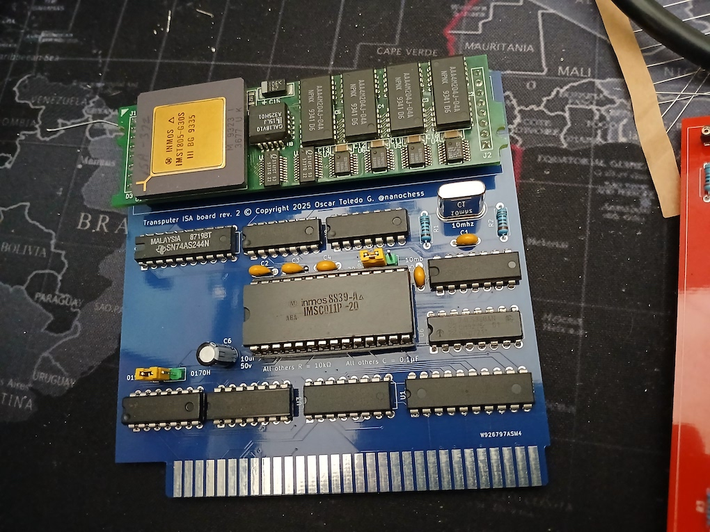

## Transputer T805 emulator
### (also including assembler, Pascal compiler, Small-C compiler and mini-OS, K&R C compiler and full OS)
#### by Oscar Toledo G. https://nanochess.org/

Once upon a time when I was a teen (1993), I wrote an almost full Pascal compiler for a transputer processor (the FILE type wasn't never completed)

It was the convergence of several things I had been learning that year: Pascal (The BYTE Book of Pascal), code generation (Compilers: Principles, Techniques and Tools), and transputer programming.

It was a time when the INMOS transputer promised parallel computing for everyone, but it was too expensive. They did a few good things, like a very fast 32-bit T805 transputer with 64-bit floating-point before the Intel 486DX2 was a thing.

In case you want to read the complete article (first in the series): [https://nanochess.org/pascal.html](https://nanochess.org/pascal.html)

I've added also my early operating system complete with simple command-line interface, text editor, C compiler, and assembler (second in the series): [https://nanochess.org/bootstrapping_c_os_transputer.html](https://nanochess.org/bootstrapping_c_os_transputer.html)

Lately I've added my full operating system complete with subdirectories, multiple drives, and with almost full K&R C compiler along syntax coloring for the editor (last in the series): [https://nanochess.org/transputer_operating_system.html](https://nanochess.org/transputer_operating_system.html)

Most recently I've added a Javascript version of the transputer emulator that can run immediately in your web browser: [https://nanochess.org/transputer_emulator.html](https://nanochess.org/transputer_emulator.html)

### What we have here

In order for you to experience my Pascal compiler, I needed to write two tools in modern C. Namely, the emulator for the transputer from the ground up, and port the assembler that ran on my Z280 host machine (the transputer was a board for the Z280 computer)

And nope, it wasn't a standard INMOS board, it was a board specifically designed for the Z280 computer.

The emulator at the start supported _only_ the instructions used by my bootstrap code, my Pascal compiler, and a Ray Tracer program I ported from C to Pascal. Later, I added a few more instructions as well.

Currently the core unhandled instructions are: _alt_, _talt_, _altwt_, _taltwt_, _altend_, _dist_, _disc_, _diss_, _enbt_, _enbc_, _enbs_, _fmul_, and _stoperr_.

The T414 unhandled instructions are _unpacksn_, _postnormsn_, _roundsn_, _ldinf_, and _cflerr_.

The T800 unhandled instructions are _move2dinit_, _move2dall_, _move2dnonzero_, _move2dzero_, _bitcnt_, _bitrevword_, _bitrevnbits_, _fpremfirst_, _fpremstep_, _fpnan_, _fpordered_, and _fpnotfinite_.

Finally, the T805 unhandled instructions are _break_, _clrj0break_, _setj0break_, _testj0break_, and _lddevid_, along with support for _j 0_ to be taken as a breakpoint.

The assembler on the other side is based on more modern code used for my later C compiler for transputer (described in the 2nd and 3rd articles), and supports the full instruction set for an Inmos T805 transputer.

Compilation instructions (macOS):

    cc tem.c -o tem
    cc tasm.c -o tasm

Compilation instructions (Linux):

    cc tem.c -o tem -lm
    cc tasm.c -o tasm
    
Compilation instructions (Windows Visual Studio 2022):

    cl tem.c -o tem
    cl tasm.c -o tasm

For Windows replace the slash / with the backslash \
    
### Pascal compiler

The Pascal compiler follows the Niklaus Wirth's 1971 specification, and it is composed of the following files:

    pascal/VARIABLE.PAS
    pascal/ERRORES.PAS
    pascal/ANALEXIC.PAS
    pascal/GENCODIG.PAS
    pascal/EXPRESIO.PAS
    pascal/SENTENCI.PAS
    pascal/DECLARAC.PAS
    pascal/PRINCIPA.PAS
    
A transputer executable is provided so you can compile programs immediately:

    pascal/pascal.cmg
    
An older version of the executable is provided for historical purposes (it has a bug handling NIL):

    pascal/pascal0.cmg
    
Two example programs are provided:

    pascal/Hanoi.pas       Hanoi tower solver (based on a book, but I forgot which one)
    pascal/Animales.pas    The animals question game.

To compile a Pascal program use this (also in *compile.sh*):

    ./tem pascal/pascal.cmg Animales.pas >animales.len
    ./tasm animales.len animales.cmg library.len
    
To execute the compiled result:

    ./tem animales.cmg
    
Also there is longer command-line for compiling the Pascal compiler. Because it is somewhat cumbersome, I put it on *make_compiler.sh*

The file *library.len* contains the support library for the Pascal compiler.

The len extension means Listado ENsamblador (Assembler listing), while the CMG extension means (Codigo Maquina G10, or G10 machine code, where G10 was the name given to the transputer board)
 
 
## Ray tracer

Once my Pascal compiler was working, I ported the Ray Tracer from the book "Programming in 3 Dimensions: 3-D Graphics, Ray Tracing, and Animation" by Watkins & Sharp.

You can compile it doing this:

    ./tem pascal/pascal.cmg pascal/M3D.PAS >m3d.len
    ./tasm m3d.len m3d.cmg library.len
    
To execute it:

    ./tem m3d.cmg m3d/BOLACRIS.M3D
    
Although originally the image was displayed directly on the screen using a different "driver" program, I considered the complications of adding the libSDL library to handle display weren't worth it, and instead I've adapted the code as necessary to avoid making yet another emulator executable, so a BMP image file named image001.bmp will appear on your directory.

I did a few demos and animations. I still haven't found the animations.

You can also find a Julia demo as pascal/julia.pas ported from the same book.

## Small-C compiler

The Small-C compiler is based on the Ron Cain's public domain Small-C compiler published in Dr. Dobb's Journal issue 45. I've ported it to transputer, and made a very much enhanced version that generates pretty small code using my tree generator evaluator (the compiler sizes up at 16 kb of code).

To execute it:

    ./tem -cc os/TC2.CMG
    
The first two questions can be answered N (stop on errors and show C language source code). It will then ask for the input file name, and the output file name.

The resulting assembly file can be passed through tasm, and added STDIO2.LEN for executing it using the emulator, or STDIO3.LEN for executing it inside the operating system (see below).

## Early operating system

This is my early version of my first operating system (Jun/1995). It is composed of several files:

    os/ARRANQUE.LEN    Boot sector.
    os/EDITOR.C        Visual text editor for running it inside the OS.
    os/ENSG10.C        The transputer assembler for running it inside the OS.
    os/INTERFAZ.C      The command-line interpreter for the OS.
    os/MONITOR.C       Debugging monitor.
    os/SOM32.C         The operating system (SOM32 stands for Sistema Operativo Mexicano 32 bits)
    os/TC.C            The Small-C compiler.
    os/TC2.C           The Small-C compiler with optimized code generator.
    os/MENSAJES.LEN    Library for assembling som32.c
    os/STDIO.LEN       Library for the tc.c compiler (running in host)
    os/STDIO2.LEN      Library for the tc2.c compiler (running in host)
    os/STDIO3.LEN      Library for the tc2.c compiler (running inside the OS)
    os/buildboot.c     Program to build a 1.44 mb disk image file.

To run the operating system (using the prebuilt disk image):

    ./tem -os os/MAESTRO.CMG os/disk.img
    
For macOS, I suggest to set your terminal in ANSI/VT100 mode, 80 columns by 25 rows, and using PC-8 or Latin/USA DOS character set. For recent Windows 10, the emulator will enable automatically the ANSI emulation.

The disk image is built with os/build_disk.sh

Each compiled C file generates a LEN file. There are many LEN files, so I've provided os/assemble_os.sh for assembling all in one pass.

It requires the host system to provide an ANSI escape terminal, because it refreshes the terminal like a text framebuffer. It works just fine in macOS, Windows, and Linux, including mapping the function and arrows keys for the visual text editor.

This environment is pretty powerful, as I evolved the operating system starting from this. 

## Full operating system

This is my full-blown operating system (Spring 1996), it includes a lot of features like multiple drives (A: is floppy, B: is RAM disk, C: is hard drive, D: is a CD-ROM in ISO-9660 format)

The C compiler supports the full K&R syntax (except for static and extern, because there's no linker).

To run the operating system (using the prebuilt disk image):

    ./tem -os2 os_final/MAESTRO.CMG os_final/floppy.img os_final/harddisk.img
    
You can add optionally an extra argument with an ISO file for getting CD-ROM access.

I suggest to set your macOS terminal to ANSI/VT100 mode, 80 columns by 25 rows, and using ISO Latin 1 or ISO-8859-1 character set (this is automatically done in a recent build of Windows 10). My personal terminal added block shapes in the characters $80-$9f, but these will appear as blank in macOS, or weird symbols in Windows and Linux.

Some commands you can test inside the operating system:

    DIR A:
    DIR C:
    AYUDA
    MEM
    C:EDITOR

In macOS you can use Fn+F1 to access the help box of the visual text editor, and type Fn+F4 to open the directory browsing for reading text files.

In Windows and Linux you can use F1 to access the help box of the visual text editor, and type F4 to open the directory browsing for reading text files.

Use C:CC to invoke the C compiler, C:ENS to invoke the assembler, C:EJECUTABLE to build assembler output into a working executable. There are instructions for compiling programs in the C:/Documentos/Programas.doc file.

This is an example compilation of a program:

    C:CC
    N
    N
    C:/C/Hora.c
    B:Hora.len
    
    C:ENS
    B:Hora.len
    C:/Lib/stdio.len
    [empty line]
    B:Hora.e

    C:EJECUTABLE
    B:Hora.e
    512
    0
    C:Hora.p
    
The disk images are built with build_f1.sh, build_f2.sh, and build_hd.sh and require some time for you to copy the files into the drives (from the emulated floppy disk to the emulate hard disk drive).

After you do some developing inside the hard disk drive image, you need a way to extract back the data, so I've developed the extractimage.c utility, in order to dump a complete hard disk drive image as a tree of files.

## Javascript emulator

Someone asked me about an online version of the emulator, and I thought it was a good idea, because installing the Visual Studio C compiler in Windows can take around one hour an half.

It wasn't so easy because Javascript always works with floating-point, and the bitwise operations convert anything into signed 32-bit integers.

I've used the excellent jsTerm package (MIT license) to provide the output, and also I was able to integrate my video font (an improved VGA font along box graphics).

You can find it in the JS directory.

It is also hosted here: [https://nanochess.org/transputer_emulator.html](https://nanochess.org/transputer_emulator.html)

## ISA board

Recently I made an ISA board compatible with the Inmos B004, because some people was asking about the possibility of running my software on real hardware. So I made programs to run with this real hardware.

The _tram_ directory contains the _comm.asm_ program for MS-DOS that replicates the input/output function of my transputer emulator. 

Currently you can run the Pascal compiler, the Ray Tracer, and any compiled Pascal program. I've ported my transputer assembler _tasm_ to Turbo C++ 3.0, so you have the complete toolchain to rebuild the Pascal compiler.

In case you want to rebuild the assembler with Turbo C++ 3.0, you just need to set the Compact model (compiler options), load the _tram/tasm.c_ file, and do _Build all_

The _comm2.asm_ program for MS-DOS allows you to run my small operating system from a real 1.44mb floppy disk.

I've tested also the Inmos Occam compiler and it works just fine.

The _pcb_ directory contains the schematics for my board, along the PCB files to order it from PCBway. I've been careful of not using surface mount components to ease building. You can select the link speed between 10 mbits and 20 mbits, and the port 0150H or 0170H.

Please notice that the port 0170h is only for a software I want to write in the future, and it isn't compatible with the Inmos software, because the Error bit is still located at 0160h (not used by my software).

## Further notes

The original programs are under _pascal/original_ because I translated _Animales.pas_ to English. I intend to translate also the compiler error messages, but in the meanwhile it isn't urgent.

The _tasm_ (transputer assembler) program is still in Spanish. It should be translated to English.

I'm afraid the whole of the Pascal files are commented in Spanish and even the variable names are Spanish. Also the complete operating system, K&R C compiler, and assorted utilities. But given it is a ton of code, I preferred to leave it as such.
